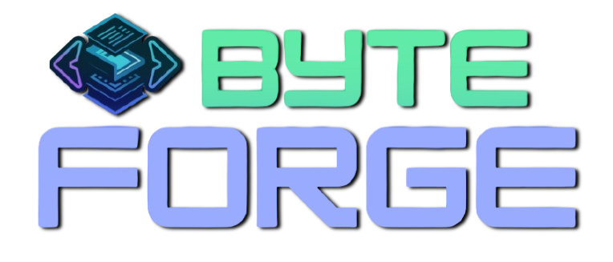

# <div align="center">  </div>

> **Your Ultimate Platform for Learning Programming, Simplified.**

<h1 style="text-align: center; color: #FF5733; font-size: 1.8em; font-weight: bold; font-family: Arial, sans-serif;">
    📌 About ByteForge
</h1>

<pre align="center" style="font-size: 1.1em; font-family: 'Courier New', monospace;  padding: 15px; border-radius: 10px;">
ByteForge is an interactive platform designed to help students and developers master programming languages. 
It provides <b>structured tutorials</b> similar to W3Schools and GFG but with a modern touch, 
<b>course-based learning</b>, and <b>dark-themed content rendering like GitHub</b>.
</pre>

<h1 style="text-align: center; color: #FF5733; font-size: 1.8em; font-weight: bold; font-family: Arial, sans-serif;"> ✨ Features </h1>

<div style="max-width: 600px; margin: auto; font-size: 1.2em; font-family: 'Courier New', monospace; background: #0d1117; color: #c9d1d9; padding: 20px; border-radius: 10px; box-shadow: 2px 2px 10px rgba(0, 0, 0, 0.5); line-height: 1.6;">
    <p style="margin: 10px 0;">✅ <b>Course-based structured tutorials</b> 📚</p>
    <p style="margin: 10px 0;">✅ <b>Markdown-powered content management</b> 📝</p>
    <p style="margin: 10px 0;">✅ <b>Dark theme for better readability</b> 🌙</p>
    <p style="margin: 10px 0;">✅ <b>Multi-language support</b> 🌍</p>
    <p style="margin: 10px 0;">✅ <b>Interactive code snippets & playground</b> 💻</p>
    <p style="margin: 10px 0 30px 0;">✅ <b>Easy navigation with categorized sections</b> 🏷️</p>
</div>

<h1 style="text-align: center; color: #FF5733; font-size: 1.8em; font-weight: bold; font-family: Arial, sans-serif;"> 🛠 Tech Stack </h1>

- **Frontend:**  
- **Backend:**  
- **Database:** 
- **Storage:** 
- **Other Tools:**   

<h1 style="text-align: center; color: #FF5733; font-size: 1.8em; font-weight: bold; font-family: Arial, sans-serif;"> 📂 Project Structure </h1>

```bash
byteforge/
├── frontend/  # React Frontend
├── backend/   # Express Backend
└── README.md  # This file 😎
```

<h1 style="text-align: center; color: #FF5733; font-size: 1.8em; font-weight: bold; font-family: Arial, sans-serif;"> 🚀 Getting Started </h1>

### 1️⃣ Clone the Repository

```sh
git clone https://github.com/your-repo/byteforge.git
cd byteforge
```

### 2️⃣ Install Dependencies

```sh
# Install for client & server
yarn install  # or npm install
```

### 3️⃣ Run the Development Server

```sh
yarn dev  # Starts both frontend & backend
```

<div align="center">
<h2 style="font-size: 28px; color: #FFD700; font-family: Arial, sans-serif; border-bottom: 2px solid #FFD700; display: inline-block; padding-bottom: 5px;">
        📞 Contact Me
    </h2>
    <p style="font-size: 18px; color: #E0E0E0;">
        Feel free to connect with me on the following platforms:
    </p>

[](https://www.linkedin.com/in/mohammad-zaid-khan-020199260/) [](https://www.instagram.com/mzaidkhan2004) [](https://x.com/MOHAMMA95772319) [](https://innospark.netlify.app/) [](https://wa.me/+919770869177) [](https://your-pubg-profile-link) [](mailto:zk286187@gmail.com)

<div>

---

**~~ByteForge - Code, Learn, Conquer.** ✨
